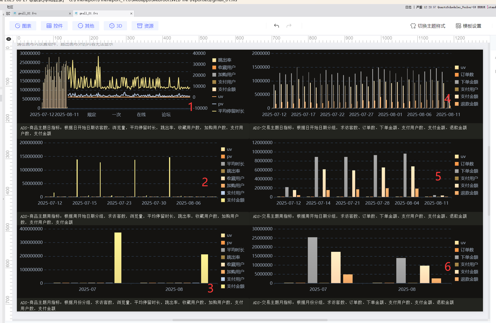

# 电商数据仓库与商品主题监控看板项目解析
# 一、项目背景
这是一个电商数据仓库建设项目，旨在为企业构建完整的电商数据分析体系，特别聚焦于商品主题的宏观监控。项目由八维文化与产业研究院于2025年1月发起，属于大数据方向的电商数仓项目系列。
# 二、项目组成
项目包含两个主要部分：
1. **数据模拟生成**：通过Python脚本(`ods_data.py`)生成模拟的电商业务数据
2. **数据仓库构建**：包含ODS、DWD、DWS、ADS四层的数据仓库SQL脚本
# 三、技术实现特点
1. **完整的数据流**：
    - ODS层：存储原始业务数据(商品、访问、收藏、加购、订单、支付、退款)
    - DWD层：明细数据层，关联商品信息并清洗数据
    - DWS层：汇总数据层，按日/周/月聚合关键指标
    - ADS层：应用数据层，直接服务于前端可视化看板
# 四、设计说明
## ODS
### 1. 商品信息表 (ods_product_info)
**设计目的**：记录平台所有商品的基本信息，为商品维度和分类维度的分析提供基础数据。
**关键字段说明**：
- `product_id` 作为主键，唯一标识每个商品，是后续所有行为分析的基础关联字段
- `product_name` 记录商品名称，用于展示和筛选
- `category_id` 和 `category_name` 同时存储，既便于关联查询又减少join操作，提高查询效率
- `price` 使用DECIMAL(10,2)类型精确存储价格，支持后续的金额计算
- `create_time` 记录商品上架时间，可用于分析新品表现
  **设计方案**：该表作为维度表，采用星型模型设计，后续所有事实表都将通过product_id与其关联。
### 2. 商品访客表 (ods_product_visit)
**设计目的**：记录用户对商品的访问行为，分析商品流量和用户行为特征。
**关键字段说明**：
- `visit_id` 自增主键，确保每条访问记录唯一
- `stay_seconds` 记录停留时间，是判断用户兴趣度的重要指标
- `terminal_type` 使用枚举类型限定取值，确保数据规范性
- `is_micro_detail` 新增字段，标记停留≥3秒的深度访问用户，用于识别高质量流量
  **设计方案**：通过分析该表的访问时间分布、停留时长和终端类型，可以优化商品详情页设计。新增的微详情访客标识有助于精准识别潜在购买用户。
### 3. 商品收藏表 (ods_product_favorite)
**设计目的**：记录用户的商品收藏行为，反映用户长期兴趣和购买意向。
**关键字段说明**：
- `fav_id` 自增主键，确保每条收藏记录唯一
- `fav_time` 精确到秒级，可用于分析收藏行为的时间特征
- 仅存储必要字段，通过关联商品表获取更多信息
  **设计方案**：收藏行为是用户购买意向的重要前兆指标，结合后续的购买数据可以计算收藏转化率。
### 4. 商品加购表 (ods_product_cart)
**设计目的**：记录用户将商品加入购物车的行为，反映用户短期购买意向。
**关键字段说明**：
- `quantity` 记录加购数量，是需求预测的重要依据
- `cart_time` 精确记录加购时间，可用于分析加购到购买的转化周期
  **设计方案**：购物车是用户购买路径的关键环节，该表数据对于分析购买漏斗至关重要。
### 5. 订单信息表 (ods_order_info)
**设计目的**：记录用户下单信息，是交易分析的核心数据。
**关键字段说明**：
- `order_amount` 记录订单金额，用于销售业绩分析
- `terminal_type` 区分下单终端，分析用户购买渠道偏好
- 新增 `activity_type` 字段，标记订单参与的活动类型（如聚划算），用于评估营销活动效果
  **设计方案**：作为核心交易事实表，该表将关联支付和退款数据，形成完整的交易链路分析。
### 6. 支付信息表 (ods_payment_info)
**设计目的**：记录订单支付信息，分析支付行为和资金流转。
**关键字段说明**：
- `pay_amount` 可能与订单金额不同（如部分支付情况）
- `pay_time` 记录实际支付时间，计算下单到支付的间隔
- 新增 `activity_type` 与订单表保持一致，确保活动分析一致性
  **设计方案**：支付是交易完成的标志，该表数据用于计算实际成交金额和支付转化率。
### 7. 退款信息表 (ods_refund_info)
**设计目的**：记录退款信息，监控商品和服务质量。
**关键字段说明**：
- `refund_amount` 记录实际退款金额
- `refund_type` 区分仅退款和退货退款，分析退款原因
- `refund_time` 记录退款处理时间，评估售后效率
  **设计方案**：退款数据是商品和服务质量的重要反馈，结合订单数据可以计算退款率等关键指标。
### 整体设计思路
1. **星型模型**：以商品表为核心维度表，其他行为表作为事实表，形成星型模型结构
2. **行为链路完整**：覆盖从访客→收藏/加购→下单→支付→退款的完整用户行为路径
3. **新增分析维度**：
    - 新增微详情访客标识，细化流量质量分析
    - 统一活动类型字段，支持营销活动效果评估
4. **性能考虑**：
    - 适当冗余字段（如分类名称）减少关联查询
    - 使用枚举类型确保数据规范性
    - 时间字段精确到秒级，支持精细分析
      该设计支持从流量获取、用户行为到交易转化的全链路分析，满足电商平台的核心数据分析需求。
## 采集数据
- **构建电商业务仿真数据**
    - 模拟电商平台的核心业务数据（商品、用户行为、交易、支付、售后等）
    - 用于测试数据分析系统、验证数据仓库模型或演示BI工具
- **生成ODS层原始数据**
    - ODS层是数据仓库中最接近源数据的层级，保留原始业务系统的数据结构
    - 为后续的DWD（明细数据层）和DWS（汇总数据层）提供数据基础

| 数据表                    | 模拟行为       | 关键字段说明                     |
| ---------------------- | ---------- | -------------------------- |
| `ods_product_info`     | 200个商品基本信息 | 价格、分类、创建时间                 |
| `ods_product_visit`    | 2万次商品浏览行为  | 停留时间、终端类型、**是否微详情**（停留≥3秒） |
| `ods_product_favorite` | 8千次收藏行为    | 用户与商品关联                    |
| `ods_product_cart`     | 7千次加购行为    | 商品数量                       |
| `ods_order_info`       | 1万笔订单      | 订单金额、终端类型、**活动类型**（聚划算等）   |
| `ods_payment_info`     | 9千笔支付记录    | 支付金额、支付时间（关联订单）            |
| `ods_refund_info`      | 3千笔退款记录    | 退款金额、退款类型（仅退款/退货退款）        |
## dwd
### 1. DWD商品信息表 (dwd_product_info)
**数据来源**：直接从ODS层的ods_product_info表抽取，保留原始商品信息不做转换。
**字段设计说明**：
- 完全继承ODS层所有字段，保持数据一致性
- 作为维度表使用，为其他事实表提供商品维度信息
- 不设置时间过滤条件，保留全量商品数据
  **设计方案**：该表作为维度表在DWD层保持原样，确保维度数据的完整性和一致性，为后续的维度分析提供基础。
### 2. DWD商品访客明细表 (dwd_product_visit)
**数据来源**：关联ods_product_visit和ods_product_info表，补充商品维度信息。
**关键设计点**：
- 新增商品名称、分类ID和分类名称字段，减少后续分析时的关联操作
- 过滤条件：只保留停留时间大于0秒的有效访问记录
- 时间范围：仅保留最近30天的数据，平衡数据量和分析需求
- 保留is_micro_detail微详情访客标识，用于深度行为分析
  **业务价值**：该表设计支持精细化流量分析，可以计算：
- 各商品的访客数和停留时长分布
- 微详情访客占比及转化路径
- 不同终端类型的访问行为差异
### 3. DWD商品收藏明细表 (dwd_product_favorite)
**数据来源**：关联ods_product_favorite和ods_product_info表。
**优化设计**：
- 补充商品维度信息，避免后续重复关联
- 时间过滤：仅保留最近30天的收藏数据，聚焦近期用户兴趣
- 去除了原表的fav_id字段，因分析场景不需要该序列号
  **分析用途**：该表设计支持：
- 商品收藏热榜分析
- 用户兴趣偏好分析
- 收藏到购买的转化漏斗分析
### 4. DWD商品加购明细表 (dwd_product_cart)
**数据来源**：关联ods_product_cart和ods_product_info表。
**设计特点**
- 保留quantity字段，支持加购数量分析
- 时间范围限定最近30天，保持数据时效性
- 补充完整的商品维度属性，便于多维分析
  **业务场景**：该表设计支持：
- 购物车商品排行分析
- 加购数量与最终购买量的相关性分析
- 加购到下单的时间间隔分析
### 5. DWD订单明细表 (dwd_order_info)
**数据来源**：关联ods_order_info和ods_product_info表。
**关键设计**：
- 保留activity_type活动类型字段，支持营销活动效果评估
- 包含order_amount订单金额和quantity数量，支持销售分析
- 时间过滤最近30天订单，聚焦近期交易情况
- 补充完整的商品维度信息
  **分析价值**：该表是交易分析的核心，支持：
- 商品销售排行和趋势分析
- 不同活动类型的转化效果对比
- 各终端设备的订单分布
### 6. DWD支付明细表 (dwd_payment_info)
**数据来源**：三表关联(ods_payment_info、ods_product_info和ods_order_info)。
**严格校验**：
- 支付金额必须大于0，过滤无效记录
- 支付时间不能早于订单时间，确保数据合理性
- 保留activity_type与订单表一致，确保分析一致性
- 时间范围限定最近30天
  **资金分析**：该表设计支持：
- 实际支付金额与订单金额的差异分析
- 支付成功率监控
- 各支付渠道的表现分析
### 7. DWD退款明细表 (dwd_refund_info)
**数据来源**：关联ods_refund_info和ods_product_info表。
**设计要点**：
- 保留refund_type退款类型，区分不同退款场景
- 包含refund_amount退款金额，支持退款规模分析
- 时间范围限定最近30天，聚焦近期售后问题
- 补充商品维度信息，便于问题商品定位
  **质量监控**：该表设计支持：
- 商品退款率分析
- 退款类型分布分析
- 退款处理时效分析
### 整体设计思路
1. **维度补充**：所有事实表都关联商品维度表，补充商品名称和分类信息，减少后续使用时的关联操作。
2. **数据时效性**：行为数据保留最近30天，在数据新鲜度和存储成本之间取得平衡，适合电商快速变化的业务特点。
3. **数据质量**：
    - 设置合理的过滤条件(如stay_seconds>0、pay_amount>0)
    - 确保时间逻辑合理(pay_time>=order_time)
    - 去除分析不需要的序列号字段
4. **分析友好**：
    - 统一保留activity_type字段，支持活动分析
    - 关键行为指标(如stay_seconds、quantity)完整保留
    - 时间字段均保留，支持用户行为序列分析
5. **层次清晰**：DWD层在ODS原始数据基础上进行轻度汇总和维度补充，既保持数据细节又提升易用性，为后续DWM和DWS层的聚合分析打下基础。
   该DWD层设计支持从流量获取、用户行为到交易转化的全链路分析，满足电商平台的核心数据分析需求，同时保证了数据质量和查询效率。
## dws
### 1. 商品主题日汇总表 (dws_product_day_summary)
**设计目标**：从商品维度聚合每日关键行为指标，全面反映商品表现。
**核心指标设计**：
- **流量指标**：UV(访客数)和PV(浏览量)来自商品访客表，通过COUNT DISTINCT和COUNT计算，反映商品曝光度
- **深度行为指标**：微详情访客数(is_micro_detail=1)和平均停留时长反映用户兴趣深度
- **转化指标**：收藏用户数、加购用户数及数量来自对应行为表，是购买前的重要转化节点
- **交易指标**：下单/支付用户数、金额和数量关联订单和支付表，计算实际销售表现
- **特色指标**：聚划算支付金额单独统计，评估营销活动效果；件单价(pay_amount/quantity)反映商品价格定位
  **特殊处理**：
- 跳出率计算：停留≤3秒的访问占比，识别内容质量问题
- 动销商品数：当日有支付的商品数，反映商品活跃度
- 使用LEFT JOIN确保基础流量数据完整，避免因后续行为缺失导致数据丢失
  **业务应用**：商品运营看板、选品优化、库存预测、活动效果评估
### 2. 用户主题日汇总表 (dws_user_day_summary)
**设计目标**：从用户维度聚合行为数据，构建用户画像基础。
**分层指标设计**：
- **浏览层**：访问商品数和PV反映用户活跃度
- **互动层**：收藏和加购次数体现用户兴趣强度
- **交易层**：下单和支付次数及金额衡量用户价值
- **售后层**：退款金额识别潜在不满意用户
  **关键技术**：
- 使用子查询先标记各行为是否存在(0/1标志)，再汇总避免重复计数
- COALESCE处理NULL值，确保数值计算安全
- 按用户+商品粒度预处理，再聚合到用户日维度
  **分析价值**：
- 用户活跃度分层运营
- 高价值用户识别
- 用户行为路径分析
- 流失用户预警
### 3. 活动主题日汇总表 (dws_activity_day_summary)
**设计目标**：评估各营销活动的投入产出比。
**指标体系**：
- **参与度**：UV衡量活动覆盖用户规模
- **转化效果**：下单金额反映意愿转化，支付金额确认实际效果
- **质量指标**：退款金额评估活动带来的售后压力
  **设计特点**：
- 以订单表的活动类型为基准，确保活动归属准确
- 关联支付和退款数据，形成完整转化漏斗
- 特别区分"无活动"(NONE)基线数据，便于效果对比
  **优化方向**：活动ROI计算、资源分配优化、活动类型效果对比
### 4. 交易主题日汇总表 (dws_trade_day_summary)
**设计目标**：监控平台整体交易健康度。
**核心指标**：
- **规模指标**：订单数和金额反映业务体量
- **转化指标**：支付用户数/金额对比下单数据计算转化率
- **质量指标**：退款金额占比评估交易质量
  **数据处理**：
- 以订单表为基准，确保所有交易都被统计
- 支付和退款数据通过order_id精确关联
- 使用COUNT DISTINCT避免重复计算用户和订单
  **监控场景**：
- 每日交易波动监控
- 转化漏斗分析
- 退款率异常预警
- GMV达成进度跟踪
### 整体设计方法论
1. **星型模型扩展**：在DWD明细数据基础上，按照不同主题维度(商品/用户/活动)进行聚合
2. **时间粒度统一**：全部采用日汇总粒度，平衡时效性和数据量，支持按日/周/月灵活上卷
3. **指标分层设计**：
    - 流量层(UV/PV)
    - 行为层(收藏/加购)
    - 交易层(下单/支付)
    - 售后层(退款)
4. **数据完整性保障**：
    - 以基础事实表(如访问/订单)为基准LEFT JOIN
    - 使用COALESCE处理NULL值
    - 精确的日期关联条件(=DATE())
5. **高性能考虑**：
    - 预聚合减少实时计算压力
    - 复合主键优化查询
    - 最近30天数据滚动更新
      该DWS层设计实现了从不同业务视角的主题化数据聚合，既支持高层次的经营分析，又能下钻到具体维度寻找问题原因，形成了完整的电商数据分析体系。

## ads
### 1. 商品主题日指标 (ads_product_day)
#### 设计目的
商品主题日指标用于从多个维度分析商品每日的表现情况，包括用户行为、转化率和财务指标，帮助运营团队了解商品每日的健康状况和销售表现。
#### 字段来源与设计思路
- **基础信息字段**：product_id、product_name、category_id、category_name来自商品维度表，用于标识商品和分类。
- **用户行为指标**：
    - uv(访客数)和pv(浏览量)来自用户行为日志，统计访问商品的独立用户数和总浏览次数。
    - avg_stay_seconds(平均停留时长)计算用户在商品页面的平均停留时间，反映内容吸引力。
    - bounce_rate(跳出率)统计只访问一个页面就离开的会话比例，反映页面质量。
    - fav_users(收藏用户数)和cart_users(加购用户数)来自用户行为数据，反映用户兴趣程度。
- **转化指标**：
    - order_users(下单用户数)和pay_users(支付用户数)来自订单事实表，反映转化效果。
- **财务指标**：
    - pay_amount(支付金额)和refund_amount(退款金额)来自支付和退款事实表，反映商品盈利能力。
#### 设计方案
直接从dws_product_day_summary汇总表获取数据，保持原子粒度(每日每商品)，便于下钻分析。
### 2. 商品主题周指标 (ads_product_week)
#### 设计目的
提供商品维度的周度汇总视图，帮助分析商品在一周内的整体表现趋势，便于制定周度运营策略。
#### 字段来源与设计思路
大部分字段与日指标相同，但采用周汇总方式：
- week_start使用周起始日期(周一)作为标识。
- 数值型指标(uv、pv等)进行SUM汇总。
- 比率型指标(bounce_rate)采用平均值计算。
- 平均停留时间也采用平均值计算。
#### 设计方案
从日汇总表按周(YEARWEEK函数)和商品维度分组聚合，保留商品所有关键指标。
### 3. 商品主题月指标 (ads_product_month)
#### 设计目的
提供月度视角的商品表现分析，适合长期趋势观察和月度经营分析。
#### 字段来源与设计思路
与周指标类似，但：
- month_key采用'YYYY-MM'格式标识月份。
- 所有指标按月份和商品维度汇总。
#### 设计方案
从日汇总表按月(DATE_FORMAT函数)和商品维度分组聚合，计算方法与周指标一致。
### 4. 平台交易日指标 (ads_trade_day)
#### 设计目的
从平台整体角度监控每日交易健康度，反映平台整体经营状况。
#### 字段来源与设计思路
- uv(访客数)来自用户访问日志。
- order_count(订单数)和total_order_amount(下单金额)来自订单事实表。
- pay_user_count(支付用户数)和total_pay_amount(支付金额)来自支付事实表。
- total_refund_amount(退款金额)来自退款事实表。
#### 设计方案
直接从dws_trade_day_summary获取平台级日汇总数据，保持原子粒度。
### 5. 平台交易周指标 (ads_trade_week)
#### 设计目的
分析平台周度交易趋势，便于制定周度运营策略和促销活动。
#### 字段来源与设计思路
与日指标相同，但按周汇总：
- week_start使用周起始日期(周一)作为标识。
- 所有数值指标进行SUM汇总。
#### 设计方案
从日汇总表按周(YEARWEEK函数)分组聚合。
### 6. 平台交易月指标 (ads_trade_month)
#### 设计目的
提供平台月度经营视图，用于月度经营分析和KPI考核。
#### 字段来源与设计思路
与周指标类似，但：
- month_key采用'YYYY-MM'格式标识月份。
- 所有指标按月汇总。
#### 设计方案
从日汇总表按月(DATE_FORMAT函数)分组聚合。
### 整体设计原则
1. **层次性**：保持日、周、月三级时间粒度，满足不同分析需求。
2. **一致性**：相同指标在不同时间粒度采用相同的计算逻辑。
3. **可追溯性**：周/月指标可从日指标汇总得到，确保数据一致性。
4. **关键性**：只包含最核心的运营指标，避免过度复杂。
5. **性能优化**：在DWS层完成复杂计算，ADS层简单汇总或直接引用。
# 报表

   图一：ADS-商品主题日指标：根据商品名称分组，求访客数，浏览量，平均停留时长，跳出率，收藏用户数，加购用户数，支付用户数，支付金额
   图二：ADS-商品主题周指标：根据商品名称分组，求访客数，浏览量，平均停留时长，跳出率，收藏用户数，加购用户数，支付用户数，支付金额
   图三：ADS-商品主题月指标：根据商品名称分组，求访客数，浏览量，平均停留时长，跳出率，收藏用户数，加购用户数，支付用户数，支付金额
   图四：ADS-交易主题日指标：根据商品名称分组，求访客数、订单数、下单金额、支付用户数、支付金额、退款金额
   图五：ADS-交易主题周指标：根据商品名称分组，求访客数、订单数、下单金额、支付用户数、支付金额、退款金额
   图六：ADS-交易主题月指标：根据商品名称分组，求访客数、订单数、下单金额、支付用户数、支付金额、退款金额