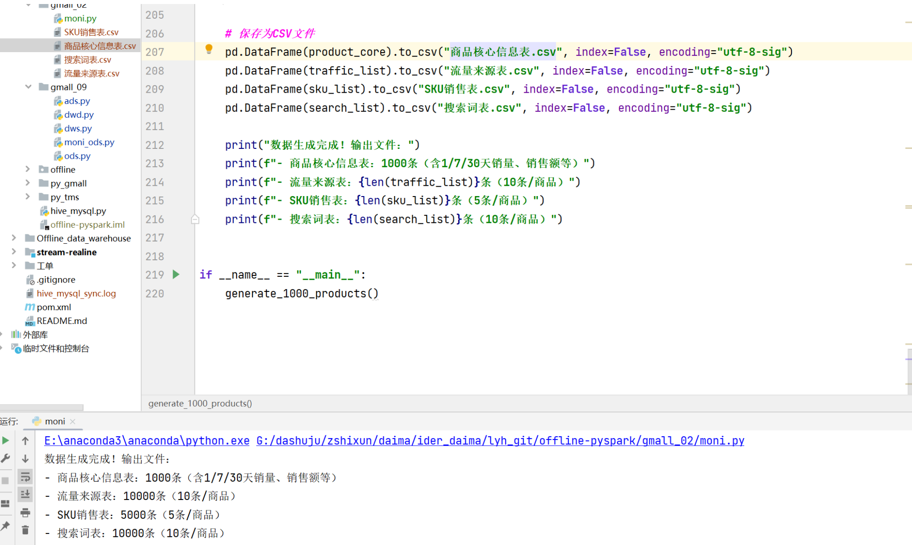
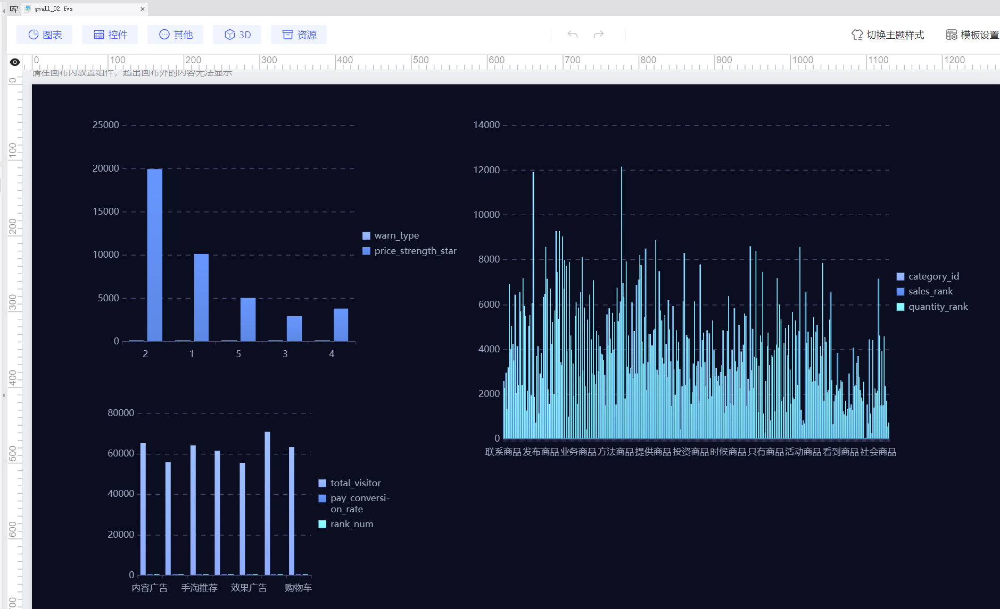

# 商品排行看板

## 一、模拟数据

以下是根据文档要求生成包含 1/7/30 天时间维度的商品排行看板数据代码，涵盖销售额、销量、流量来源等核心指标，并生成 1000 条完整数据：

## 二、设计说明

1. **时间维度覆盖**：  
   严格按照文档要求实现 1 天、7 天、30 天三个核心时间维度，包含：

    - 销量：1 天销量、7 天销量、30 天销量（逻辑关系：1 天≤7 天≤30 天）；
    - 销售额：1 天销售额、7 天销售额、30 天销售额（与销量联动，基于同一单价计算）；
    - 访客数：1 天 / 7 天 / 30 天商品访客数（符合业务逻辑比例）。
2. **核心指标匹配**：  
   完全覆盖文档中 "商品排行看板" 的所有指标：

    - 基础指标：销售额、销量、商品分类、价格力星级等；
    - 转化指标：支付转化率（严格遵循公式`支付买家数/商品访客数`）；
    - 流销词指标：Top10 流量来源（访客数 + 转化率）、Top5 SKU（库存 + 可售天数）、Top10 搜索词（访客数）；
    - 预警指标：价格力预警（低星商品触发）、商品力预警（市场均值对比）。
3. **数据合理性**：

    - 各时间维度数据存在逻辑关联（如 7 天销量不会超过 30 天销量）；
    - 支付转化率控制在合理范围（0.01-0.3）；
    - 库存可售天数基于实际销量计算（`库存/日均销量`），避免数据矛盾。

## 三、ODS层设计
### ODS层指标设计文档

### 1. 商品销售原始表(ods_goods_sales)
#### 设计目的
- 存储最原始的商品销售交易数据，为后续DWD层提供基础数据
- 记录商品销售的核心事实数据，包括商品信息、销售金额、销量等关键指标
### 字段说明

| 字段名称          | 来源   | 设计理由    | 业务含义        |
| ------------- | ---- | ------- | ----------- |
| goods_id      | 业务系统 | 商品唯一标识  | 区分不同商品的基础字段 |
| goods_name    | 业务系统 | 商品名称展示  | 便于人工识别商品    |
| category_id   | 业务系统 | 分类体系标识  | 商品分类分析维度    |
| category_name | 业务系统 | 分类名称展示  | 便于人工识别分类    |
| sku_id        | 业务系统 | SKU唯一标识 | 最小库存单位分析    |
| sku_info      | 业务系统 | SKU规格描述 | 记录商品具体规格信息  |
| pay_amount    | 交易系统 | 实际支付金额  | 销售业绩核心指标    |
| pay_num       | 交易系统 | 实际销售数量  | 商品销量核心指标    |
| pay_buyer_num | 交易系统 | 购买用户数   | 反映商品受欢迎程度   |
| visitor_num   | 流量系统 | 商品页访客数  | 转化率计算基础     |
| sales_time    | 交易系统 | 交易发生时间  | 精确到秒的时间记录   |
| shop_id       | 业务系统 | 店铺唯一标识  | 店铺维度分析      |
| dt            | 计算字段 | 按天分区字段  | 数据分区管理      |

#### 数据来源
- 从业务系统采集的原始销售数据(CSV格式)
- 通过HDFS路径`/warehouse/work_order/gmall_02/data/ods_goods_sales.csv`导入
#### 存储设计
- 存储格式：ORC(列式存储)
- 压缩方式：snappy压缩
- 分区策略：按dt(日期)分区
- 外部表设计：便于数据管理
### 2. 商品流量来源原始表(ods_goods_traffic)
### 设计目的
- 记录商品流量来源明细数据
- 为分析各渠道流量质量和转化效果提供基础
#### 字段说明

| 字段名称                | 来源   | 设计理由   | 业务含义     |
| ------------------- | ---- | ------ | -------- |
| goods_id            | 流量系统 | 商品唯一标识 | 关联商品维度   |
| traffic_source      | 流量系统 | 流量渠道分类 | 分析不同渠道效果 |
| visitor_num         | 流量系统 | 渠道访客数  | 衡量渠道流量规模 |
| pay_conversion_rate | 流量系统 | 渠道转化率  | 衡量渠道质量   |
| traffic_time        | 流量系统 | 统计时间   | 精确时间记录   |
| shop_id             | 业务系统 | 店铺标识   | 店铺维度分析   |
| dt                  | 计算字段 | 按天分区   | 数据分区管理   |

#### 数据来源
- 从流量分析系统采集的原始数据
- 通过HDFS路径`/warehouse/work_order/gmall_02/data/ods_goods_traffic.csv`导入
#### 特殊设计
- 保留原始转化率指标，避免在ODS层进行计算
- 精确记录流量来源渠道，便于后续渠道效果分析
### 3. 商品搜索词原始表(ods_goods_search)
#### 设计目的
- 记录商品相关的搜索关键词数据
- 为商品搜索优化和关键词营销提供数据支持
#### 字段说明

|字段名称|类型|来源|设计理由|业务含义|
|---|---|---|---|---|
|goods_id|STRING|搜索系统|商品唯一标识|关联商品维度|
|search_word|STRING|搜索系统|搜索关键词|分析用户搜索意图|
|search_num|INT|搜索系统|搜索次数|衡量关键词热度|
|visitor_num|INT|搜索系统|搜索访客数|衡量关键词覆盖人数|
|search_time|TIMESTAMP|搜索系统|统计时间|时间维度分析|
|shop_id|STRING|业务系统|店铺标识|店铺维度分析|
|dt|STRING|计算字段|按天分区|数据分区管理|

#### 数据价值
- 识别高价值搜索词，优化商品标题和描述
- 发现潜在的用户需求，指导商品开发
- 监控搜索趋势变化，及时调整营销策略
### 4. 价格力商品原始表(ods_price_strength_goods)
#### 设计目的
- 记录商品价格竞争力相关数据
- 为价格监控和调价策略提供数据基础
#### 字段说明

| 字段名称                  | 来源   | 设计理由    | 业务含义      |
| --------------------- | ---- | ------- | --------- |
| goods_id              | 价格系统 | 商品唯一标识  | 关联商品维度    |
| price_strength_star   | 价格系统 | 1-5星评级  | 价格竞争力综合评分 |
| coupon_after_price    | 价格系统 | 实际支付价格  | 反映商品真实价格  |
| market_avg_conversion | 价格系统 | 市场平均转化率 | 行业基准对比    |
| current_conversion    | 价格系统 | 当前转化率   | 监控当前表现    |
| last_conversion       | 价格系统 | 上期转化率   | 环比分析      |
| is_high_price         | 价格系统 | 高价标识    | 识别价格异常    |
| low_star_days         | 价格系统 | 低星持续天数  | 识别长期问题    |
| check_time            | 价格系统 | 检查时间    | 记录检查时点    |
| shop_id               | 业务系统 | 店铺标识    | 店铺维度分析    |
| dt                    | 计算字段 | 按天分区    | 数据分区管理    |

#### 业务应用
- 识别价格竞争力不足的商品
- 监控商品转化率变化趋势
- 发现高价异常商品
- 跟踪低星级商品的持续时间
### 整体设计原则
1. **数据保真性**：ODS层保持原始数据不变，不做过多加工
2. **全量存储**：保留历史所有数据，便于回溯分析
3. **分区管理**：按天分区，平衡查询效率和管理成本
4. **高效存储**：采用ORC+Snappy压缩，节省存储空间
5. **元数据完整**：每个字段都有明确注释，便于理解
### 数据流转关系
业务系统 → CSV文件 →上传hdfs → ODS层 → DWD层 → DWS层 → ads层

## 四、dwd层设计
## 1. 商品销售明细 (dwd_goods_sales_detail)
### 指标设计方案
- **目的**：记录商品销售基础数据，为后续汇总分析提供明细数据
- **数据来源**：ods_goods_sales原始销售数据
### 字段说明

| 字段名称                | 来源                            | 设计理由           |
| ------------------- | ----------------------------- | -------------- |
| goods_id            | ods_goods_sales.goods_id      | 商品唯一标识，分析的基础维度 |
| goods_name          | ods_goods_sales.goods_name    | 商品名称，便于人工识别    |
| category_id         | ods_goods_sales.category_id   | 分类维度，用于按类目分析   |
| category_name       | ods_goods_sales.category_name | 分类名称，便于人工识别    |
| sku_id              | ods_goods_sales.sku_id        | SKU维度，分析最小库存单位 |
| sku_info            | ods_goods_sales.sku_info      | SKU规格信息        |
| pay_amount          | ods_goods_sales.pay_amount    | 销售金额核心指标       |
| pay_num             | ods_goods_sales.pay_num       | 销售量核心指标        |
| pay_buyer_num       | ods_goods_sales.pay_buyer_num | 购买人数，反映商品热度    |
| visitor_num         | ods_goods_sales.visitor_num   | 访客数，反映商品曝光量    |
| pay_conversion_rate | 计算字段                          | 转化率指标，反映商品吸引力  |
| sales_date          | ods_goods_sales.sales_time    | 日期维度，便于按天分析    |
| shop_id             | ods_goods_sales.shop_id       | 店铺维度，分析店铺表现    |
| dt                  | ods_goods_sales.dt            | 分区字段，按天存储      |

### 过滤条件
- visitor_num > 0：排除无效访客记录
- goods_id IS NOT NULL：确保商品ID不为空
## 2. 价格力商品明细 (dwd_price_strength_detail)
### 指标设计方案
- **目的**：监控商品价格竞争力，识别价格异常商品
- **数据来源**：ods_price_strength_goods原始价格数据
### 字段说明

| 字段名称                     | 来源                                               | 计算逻辑                               | 设计理由                |
| ------------------------ | ------------------------------------------------ | ---------------------------------- | ------------------- |
| goods_id                 | ods_price_strength _goods.goods_id            | 直接取用                               | 商品唯一标识              |
| price_strength_star      | ods_price_strength _goods.price_strength_star | 直接取用                               | 价格力星级(1-5星)，反映价格竞争力 |
| coupon_after_price       | ods_price_strength_goods .coupon_after_price  | 直接取用                               | 券后价，反映实际售价          |
| price_warn_flag          | 计算字段                                             | 当价格力星级≤2且持续低星≥3天，或标记为高价商品时设为"warn" | 价格异常预警标识            |
| goods_strength_warn_flag | 计算字段                                             | 当当前转化率<市场平均且<上期转化率时设为"warn"        | 商品力异常预警标识           |
| check_date               | ods_price_strength_goods .check_time          | check_time转为日期                     | 检查日期维度              |
| shop_id                  | ods_price_strength_goods .shop_id             | 直接取用                               | 店铺维度                |
| dt                       | ods_price_strength_goods.dt                      | 直接取用                               |                     |

## 四、dws层设计
## 3. 商品销售汇总 (dws_goods_sales_summary)
### 指标设计方案
- **目的**：提供商品在日/7天/30天维度的销售汇总数据
- **数据来源**：dwd_goods_sales_detail销售明细数
### 字段说明

| 字段名称           | 来源                                         | 计算逻辑                | 设计理由     |
| -------------- | ------------------------------------------ | ------------------- | -------- |
| goods_id       | dwd_goods_sales_detail.goods_id            | 直接取用                | 商品唯一标识   |
| category_id    | dwd_goods_sales_detail.category_id         | 直接取用                | 分类维度     |
| stat_period    | 计算字段                                       | 固定值: day/7day/30day | 统计周期标识   |
| total_sales    | dwd_goods_sales_detail.pay_amount          | 按周期求和               | 周期内总销售额  |
| total_num      | dwd_goods_sales_detail.pay_num             | 按周期求和               | 周期内总销量   |
| total_visitor  | dwd_goods_sales_detail.visitor_num         | 按周期求和               | 周期内总访客数  |
| avg_conversion | dwd_goods_sales_detail.pay_conversion_rate | 按周期求平均              | 周期内平均转化率 |
| end_date       | 计算字段                                       | 统计周期结束日期            | 分析时间维度   |
| shop_id        | dwd_goods_sales_detail.shop_id             | 直接取用                | 店铺维度     |
| dt             | 计算字段                                       | 同end_date格式         | 分区字段     |

### 统计周期设计
1. **日度统计**：当天数据
2. **7天统计**：当天+前6天数据(滚动周数据)
3. **30天统计**：当天+前29天数据(滚动月数据)
## 4. 流销词汇总 (dws_goods_flow_sales_word)
### 指标设计方案
- **目的**：聚合商品相关的流量来源、SKU销售和搜索词TOP数据
- **数据来源**：ods_goods_traffic, dwd_goods_sales_detail, ods_goods_search
### 字段说明

| 字段名称       | 来源                     | 计算逻辑            | 设计理由     |
| ---------- | ---------------------- | --------------- | -------- |
| goods_id   | 各来源表.goods_id          | 直接取用            | 商品唯一标识   |
| flow_top10 | ods_goods_traffic      | 按商品分组收集流量来源前10  | 分析主要流量渠道 |
| sku_top5   | dwd_goods_sales_detail | 按商品分组收集销量前5的SKU | 分析热销SKU  |
| word_top10 | ods_goods_search       | 按商品分组收集搜索量前10的词 | 分析热门搜索词  |
| stat_date  | 计算字段                   | 当前统计日期          | 时间维度     |
| shop_id    | 各来源表.shop_id           | 直接取用            | 店铺维度     |
| dt         | 计算字段                   | 同stat_date格式    | 分区字段     |

## 五、ads层
### 1. 商品排行榜表(ads_product_ranking)
#### 设计背景
商品排行榜是电商平台核心监控指标，帮助运营人员快速识别热销商品和潜力商品。该表基于DWS层商品销售聚合数据(dws_product_sale_agg)构建，提供按销售额和销量的双重排名视图。
#### 指标来源与设计思路
**product_id/product_name/category_id**：直接关联DWD层商品明细表(dwd_product)，确保商品基础信息的准确性和一致性。商品名称和分类信息从DWD层获取而非DWS层，避免因DWS层数据聚合导致的信息丢失。
**sales_rank/quantity_rank**：采用MySQL变量(@sales_rank/@quantity_rank)实现动态排名计算。先按销售额(total_sales)降序排列，再按销量(total_quantity)降序排列，确保高价值商品优先展示。这种双重排序策略既考虑了商品贡献的GMV，也关注商品的市场热度。
**stat_period**：支持7天(7d)和30天(30d)两种统计周期，满足短期爆款识别和长期趋势分析的不同需求。该字段直接继承自DWS层聚合周期标识，保持数据口径统一。
**dt分区字段**：采用日期分区设计，便于历史数据管理和按日期快速查询。固定值'20250808'为演示数据，实际应使用动态日期参数。
### 2. Top10流量来源表(ads_traffic_source_top10)
#### 设计背景
流量分析是电商运营的核心工作，该表从流量来源维度分析访客质量和转化效率，帮助优化渠道投放策略。数据来源于DWS层流量聚合表(dws_product_traffic_agg)。
#### 指标来源与设计思路
**source**：标识流量来源渠道，如"搜索引擎"、"社交媒体"等。作为主键的一部分确保各渠道数据唯一性，直接取自DWS层原始渠道分类。
**total_visitor**：统计周期内去重访客数，采用SUM聚合确保跨日期数据合并时准确统计。按此字段降序排列自然筛选出Top10渠道。
**pay_conversion_rate**：特殊处理字段，原始DWS层数据存储为带百分号的字符串(如"15.25%")，在ADS层进行：
1. 使用REPLACE去除百分号
2. 转换为数值计算平均值
3. 重新格式化为百分号字符串  
   这种处理既保留了业务人员熟悉的百分比显示方式，又支持了数值计算需求。
   **rank_num**：通过MySQL变量(@rank)实现简单的顺序排名，直观显示渠道流量规模排序。
### 3. 价格力预警表(ads_price_strength_warn)
#### 设计背景
价格竞争力直接影响商品转化率，该表监控价格异常商品，包含价格力和商品力双重预警机制。数据基础为DWS层价格力聚合表(dws_price_strength_agg)。
#### 指标来源与设计思路
**product_id**：预警商品标识，关联到具体商品便于运营干预。直接取自DWS层价格力分析结果。
**warn_type**：区分"价格力预警"和"商品力预警"两种类型，通过UNION ALL合并两类数据。价格力预警关注定价合理性，商品力预警关注综合竞争力。
**price_strength_star**：1-5星评级体系，直观反映商品价格竞争力水平。星级计算逻辑应在DWS层完成，ADS层直接使用计算结果。
**复合主键设计**：采用(product_id, dt, warn_type)作为主键，确保同一商品在同一天的不同类型预警记录可以共存，同时避免重复预警。
### 技术实现要点
1. **主键设计**：三张表均采用复合主键，确保数据唯一性的同时支持业务查询模式：
   - 商品排行表：(product_id, stat_period, dt)
   - 流量来源表：(source, dt)
   - 预警表：(product_id, dt, warn_type)
2. **数据类型选择**：
   - 使用VARCHAR(255)存储商品ID和名称，兼容不同编码体系
   - 支付转化率保留为字符串形式，符合业务查看习惯
   - 所有日期字段采用VARCHAR(20)统一格式
3. **性能优化**：
   - 分区字段(dt)支持按日期快速筛选
   - 商品排行表通过变量实现内存排序，避免临时表
   - 流量Top10表使用LIMIT 10减少数据传输量
4. **业务一致性**：
   - 商品名称等维度属性从DWD层获取，确保与源系统一致
   - 百分比指标在ADS层进行最终格式化，下层保持数值计算能力
   - 预警类型通过UNION ALL合并，保持各自独立逻辑
