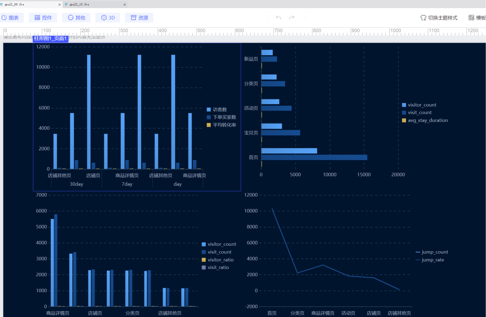

# 一、设计背景

基于业务需求，需构建包含`ODS`（原始数据层）、`DIM`（维度层）、`DWD`（明细数据层）、`DWS`（汇总数据层）、`ADS`（应用数据层）的五层数仓模型，支撑店内路径看板的流量分析需求（如页面访问排行、店内流转路径、设备端数据统计等）。

# 二、各层表结构设计

## ods层
该脚本的核心目标是将原始 CSV 日志数据同步到 Hive 的 ODS（Operational Data Store，操作数据存储）层，作为数据仓库的原始数据层。ODS 层的核心设计原则是**最大限度保留原始数据**，同时通过合理的存储格式、分区策略和元数据定义，为后续的数据清洗、分析提供基础

#### 1. 无线端入店与承接原始数据表 `ods_pc_or_wireless_entry`
##### 设计由来
用于记录用户从外部进入店铺（或商品页）的访问行为及后续转化（是否下单），需区分终端类型（PC / 无线），是分析 “入店流量质量” 和 “终端转化差异” 的基础数据。
##### 字段与逻辑说明

| 核心字段            | 作用                                                       |
| --------------- | -------------------------------------------------------- |
| `page_id`       | 页面唯一标识，定位用户访问的具体页面（如某商品详情页、店铺首页）                         |
| `page_type`     | 页面类型（店铺页 / 商品详情页等），用于归类页面，分析不同类型页面的入店情况                  |
| `visitor_id`    | 访客唯一标识，用于追踪单个用户的行为轨迹                                     |
| `visit_time`    | 访问时间，记录用户入店的时间点，是后续按时间分析的核心依据                            |
| `is_order`      | 是否下单（1 = 是，0 = 否），直接反映入店后的转化结果                           |
| `terminal_type` | 终端类型（pc/wireless），用于区分不同终端的入店转化差异                        |
| 分区`dt`          | 由`visit_time`格式化得到（yyyyMMdd），按日期分区便于按时间维度查询（如 “某天的入店数据”） |

##### 设计合理性
- 保留`is_order`字段：直接关联入店行为与转化结果，避免后续分析时需跨表关联订单数据。
- 终端类型区分：符合电商场景中 “PC 端与无线端用户行为差异显著” 的业务特点，为终端策略优化提供数据支持。
- 分区策略：按访问日期分区，符合日志数据 “时序性强” 的特点，可大幅提升按日期查询的效率。

#### 2. 店内路径流转原始数据表 `ods_instore_path`
##### 设计由来
记录用户在店铺内部的页面跳转路径（如从商品详情页→店铺首页→活动页），用于分析用户在店内的浏览轨迹，优化页面布局或引导逻辑。
##### 字段与逻辑说明

|核心字段|作用|
|---|---|
|`path_record_id`|路径记录唯一标识，唯一标记一次页面跳转行为|
|`source_page_*`|来源页面的 ID 和类型，记录用户 “从哪里来”|
|`target_page_*`|去向页面的 ID 和类型，记录用户 “到哪里去”|
|`jump_time`|跳转时间，标记路径发生的时间点|
|`visit_sequence`|访问顺序（如 1、2、3），用于还原用户的连续浏览流程（如第 1 步→第 2 步→第 3 步）|
|分区`dt`|由`jump_time`格式化得到，按日期分区，便于分析 “某天的用户路径偏好”|

##### 设计合理性
- 来源与去向页面成对出现：完整记录跳转关系，是路径分析的核心（如 “商品详情页→购物车” 的跳转率）。
- `visit_sequence`字段：解决了 “仅靠时间无法准确还原连续行为” 的问题（如同一时间可能有并发跳转），确保路径时序的准确性。
- 终端类型保留：可分析不同终端用户的路径偏好差异（如无线端更倾向于短路径跳转）。

#### 3. 页面访问排行原始数据表 `ods_page_visit_rank`
##### 设计由来
记录各页面的访问情况（包括访问时间、离开时间），用于统计页面的访问量、停留时长等指标，为 “页面热度排行” 提供原始数据。
##### 字段与逻辑说明

| 核心字段         | 作用                                              |
| ------------ | ----------------------------------------------- |
| `visit_time` | 访问开始时间，用于统计 “何时访问”                              |
| `leave_time` | 离开时间，通过`leave_time - visit_time`可计算页面停留时长（关键指标） |
| `page_type`  | 页面类型，用于按类型统计热度（如 “所有商品详情页的总访问量”）                |
| 分区`dt`       | 由`visit_time`格式化得到，支持按日期统计 “每日页面访问排行”           |

##### 设计合理性
- 包含`leave_time`：直接支持停留时长计算（无需后续关联其他表），而停留时长是衡量页面吸引力的核心指标。
- 与其他表共享`page_id`和`visitor_id`：便于与入店表、路径表关联分析（如 “某热门页面的用户来源路径”）。

#### 4. 店铺页细分类型访问原始数据表 `ods_shop_page_visit_detail`
##### 设计由来
专门针对店铺内细分页面（如首页、活动页、分类页）的访问详情，用于分析店铺内部不同功能页的表现（如活动页的引流效果）。
##### 字段与逻辑说明

|核心字段|作用|
|---|---|
|`shop_page_id`|店铺页唯一标识，定位具体店铺的页面（如 “店铺 A 的活动页”）|
|`shop_page_subtype`|店铺页细分类型（首页 / 活动页等），是该表的核心区分字段，用于分析不同子页面的表现|
|`visit_time`/`leave_time`|同`ods_page_visit_rank`，用于计算停留时长，评估子页面的吸引力|
|分区`dt`|由`visit_time`格式化得到，支持按日期分析 “店铺子页面的每日访问趋势”|

##### 设计合理性
- 细分`shop_page_subtype`：相比通用页面表（`ods_page_visit_rank`），更聚焦于店铺内部的页面结构，满足 “店铺运营” 场景的精细化分析需求（如 “活动页是否比首页更能留住用户”）。
- 字段与其他表兼容：`visitor_id`、`terminal_type`等字段与其他表一致，支持跨表关联（如 “从无线端进入活动页的用户，后续是否下单”）。
### 共性设计逻辑

1. **外部表（EXTERNAL TABLE）设计**  
   所有表均定义为外部表，数据存储在 HDFS 指定路径（`LOCATION`）。优点是：删除表时不会删除底层数据，符合 ODS 层 “原始数据不可丢失” 的要求。
2. **ORC 格式 + Snappy 压缩**  
   使用`STORED AS ORC`并启用`snappy`压缩，原因是：ORC 是列式存储格式，适合大数据场景下的高效查询（只读取需要的列）；Snappy 压缩能在较少性能损耗下大幅减少存储空间，降低 IO 成本。
3. **统一的处理流程**  
   所有表均遵循 “创建 HDFS 目录→删除旧表→建表→读 CSV→加分区列→写入 ORC→修复分区” 的流程，确保数据从原始文件到 Hive 表的一致性：
    - 修复分区（`MSCK REPAIR TABLE`）：因 Hive 外部表无法自动识别新增分区，需手动刷新元数据，保证写入的分区数据可被查询。
    - 数据量验证（`print_data_count`）：确保原始数据读取正常，避免空表或数据丢失。
4. **时间分区（dt）**  
   所有表均按`dt`（yyyyMMdd）分区，且`dt`由核心时间字段（`visit_time`/`jump_time`）转换而来，符合日志数据 “按时间产生、按时间查询” 的特性，大幅提升增量数据处理和历史数据查询的效率。
### 总结
四个表的设计均围绕 “原始数据落地 + 业务可分析性” 展开：
- 保留核心业务字段（如终端类型、时间、用户标识），满足后续多维分析需求；
- 采用适合大数据场景的存储格式和分区策略，保证数据处理和查询效率；
- 统一的处理流程确保数据链路的稳定性，符合 ODS 层作为数据仓库 “入口” 的定位。

## dwd层
### 一、dwd_wireless_entry_detail（无线端入店明细 DWD 表）
#### 设计由来
用于存储无线端（如手机、平板）用户的入店行为明细数据，是对 ODS 层`ods_pc_or_wireless_entry`表中无线端数据的清洗和标准化，为后续用户行为分析（如无线端流量、转化率）提供基础。
#### 实现逻辑
1. **数据来源**：从 ODS 层`ods_pc_or_wireless_entry`表筛选`terminal_type`为`wireless`（不区分大小写）的数据。
2. **清洗规则**：
    - 过滤`page_id`、`visitor_id`、`visit_time`为空的无效数据；
    - 限制`is_order`只能为 0 或 1（确保字段合法性）；
    - 按`page_id`、`visitor_id`、`visit_time`去重（避免重复记录）。
3. **分区设计**：按`dt`（统计日期）分区，便于按日期查询和管理数据。
4. **存储格式**：采用 PARQUET 格式 + snappy 压缩，兼顾查询性能和存储效率。
#### 设计原因
- 区分终端类型：无线端和 PC 端用户行为差异显著（如停留时长、转化路径），分开存储可提高分析精准度；
- 数据质量保障：通过空值过滤和去重，确保明细数据的准确性，为后续统计分析奠定基础；
- 分区存储：符合数据仓库按时间分区的惯例，提升按日期查询的效率。
### 二、dwd_pc_entry_detail（PC 端入店明细 DWD 表）
#### 设计由来
与无线端表对应，用于存储 PC 端用户的入店行为明细，同样基于`ods_pc_or_wireless_entry`表清洗，支撑 PC 端用户行为分析。
#### 实现逻辑
1. **数据来源**：从 ODS 层`ods_pc_or_wireless_entry`表筛选`terminal_type`为`pc`（不区分大小写）的数据。
2. **增强验证**：
    - 先检查 ODS 表中是否存在 PC 端数据（全量统计），若不存在则提示异常；
    - 再检查指定日期的 PC 端数据量，若为 0 则跳过处理（避免无效计算）。
3. **清洗规则**：与无线端一致（空值过滤、`is_order`校验、去重）。
4. **分区与存储**：同无线端，按`dt`分区，PARQUET+snappy 格式。
#### 设计原因
- 终端隔离：与无线端分开存储，满足 “分终端分析” 的业务需求（如对比 PC 和无线端的流量占比）；
- 健壮性设计：通过数据量预校验，避免因 ODS 层数据缺失导致的任务报错或无效写入；
- 结构一致性：与无线端表字段结构保持一致，便于后续跨终端联合查询。
### 三、dwd_shop_page_visit_detail_pc（PC 端店铺页访问明细 DWD 表）
#### 设计由来
聚焦 PC 端用户在店铺内各页面的访问行为（如访问时间、停留时长），基于 ODS 层`ods_shop_page_visit_detail`表清洗，用于分析店铺页的用户粘性和访问质量。
#### 实现逻辑
1. **数据来源**：从`ods_shop_page_visit_detail`表筛选`terminal_type`为`pc`的数据。
2. **数据标准化**：
    - 将`visit_time`和`leave_time`转换为标准`TIMESTAMP`类型（统一时间格式）；
    - 计算停留时长`stay_duration`（离开时间 - 访问时间，单位：秒）。
3. **清洗规则**：
    - 过滤核心字段（`shop_page_id`、`visitor_id`等）为空的数据；
    - 确保`leave_time`晚于`visit_time`（排除时间逻辑异常的数据）。
4. **写入策略**：按`dt`分区，采用`overwrite`模式覆盖当前日期分区（保证当日数据准确性）。
#### 设计原因
- 业务聚焦：专门存储店铺页访问数据，满足 “店铺运营分析” 需求（如哪个子页面停留时间最长）；
- 指标计算：通过`stay_duration`量化用户停留行为，为 “页面吸引力” 分析提供关键指标；
- 时间标准化：统一时间格式避免因 ODS 层格式混乱导致的分析误差。
### 四、dwd_shop_page_visit_detail_wireless（无线端店铺页访问明细 DWD 表）
#### 设计由来
与 PC 端店铺页表对应，用于存储无线端用户在店铺页的访问明细，支撑无线端店铺页的用户行为分析。
#### 实现逻辑
- 数据来源、清洗规则、字段设计与 PC 端完全一致，仅筛选`terminal_type`为`wireless`的数据。
- 同样计算`stay_duration`，按`dt`分区，`overwrite`模式写入当前分区。
#### 设计原因
- 终端对比需求：无线端用户在店铺页的行为（如停留时长）可能与 PC 端差异较大（如无线端更碎片化），分开存储便于对比分析；
- 结构统一性：与 PC 端表字段完全一致，确保跨终端分析时的兼容性。
### 五、dwd_instore_path_pc（PC 端店内路径流转明细 DWD 表）
#### 设计由来
记录 PC 端用户在店铺内的页面跳转路径（如从 “首页” 到 “商品详情页”），基于 ODS 层`ods_instore_path`表清洗，用于分析用户浏览轨迹和路径优化。
#### 实现逻辑
1. **数据来源**：从`ods_instore_path`表筛选`terminal_type`为`pc`的数据。
2. **字段处理**：
    - 将`jump_time`转换为`TIMESTAMP`类型（统一跳转时间格式）；
    - 提取`jump_date`（跳转日期），便于按日期聚合分析。
3. **核心字段保留**：包含`source_page_id`（来源页）、`target_page_id`（去向页）、`visit_sequence`（访问顺序）等路径分析关键字段。
4. **写入策略**：`overwrite`模式覆盖当前`dt`分区（确保当日路径数据准确）。
#### 设计原因
- 路径分析需求：用户在店内的跳转路径是优化页面布局（如增加热门路径的入口）的关键依据；
- 顺序追踪：`visit_sequence`字段可还原用户的浏览顺序，支撑 “用户行为路径图谱” 构建；
- 终端隔离：PC 端和无线端的路径习惯不同（如 PC 端可能更倾向多页面深度浏览），分开存储提升分析针对性。
### 六、dwd_instore_path_wireless（无线端店内路径流转明细 DWD 表）
#### 设计由来
与 PC 端路径表对应，记录无线端用户在店铺内的页面跳转路径，用于分析无线端用户的浏览轨迹。
#### 实现逻辑
- 数据来源、字段处理、清洗规则与 PC 端完全一致，仅筛选`terminal_type`为`wireless`的数据。
#### 设计原因
- 无线端路径特性：无线端用户可能因屏幕大小等因素，跳转路径更简洁或更随机，单独存储便于针对性分析；
- 结构统一：与 PC 端表字段一致，支持跨终端路径对比（如无线端是否更倾向直接进入商品页）。
### 整体设计逻辑总结

1. **分层思想**：基于 ODS 层数据清洗加工，构建 DWD 明细层，符合数据仓库 “ODS（原始数据）→DWD（清洗明细）→DWS（汇总）” 的分层架构，为上层分析提供高质量明细数据。
2. **终端隔离**：所有表均按 “PC 端” 和 “无线端” 拆分，因终端用户行为差异显著，隔离后分析更精准。
3. **数据质量**：通过空值过滤、字段合法性校验、去重等操作，确保 DWD 层数据的准确性和一致性。
4. **存储优化**：采用 PARQUET 列存格式 + snappy 压缩，兼顾查询性能（列存适合分析场景）和存储成本（压缩减少空间占用）。
5. **可维护性**：通过封装`create_hdfs_dir`（创建 HDFS 目录）、`repair_hive_table`（修复分区）等函数，减少重复代码，提升脚本可维护性。
## dws层
### 1. 无线端日度汇总表 `dws_wireless_entry_daily`
#### 设计由来
用于**每日汇总无线端（如移动端）不同页面类型的核心访问及转化指标**，为后续多周期统计（如 7 天、30 天）提供基础数据。
#### 逻辑说明
- **数据来源**：从 DWD 层明细数据表`dwd_wireless_entry_detail`提取当日（`dt=process_date`）数据。
- **核心字段设计**：
    - `page_type`：按页面类型（如首页、商品页）分组，满足 “不同页面类型的指标对比” 需求。
    - `visitor_count`：通过`countDistinct(visitor_id)`计算独立访客数（去重统计，反映真实用户量）。
    - `order_buyer_count`：通过`countDistinct(when(is_order=1, visitor_id))`计算下单买家数（仅统计产生订单的访客，反映转化效果）。
    - `stat_date`与`dt`：`stat_date`为日期类型（便于日期计算），`dt`为分区字段（与`stat_date`一致，符合数据仓库按日期分区的规范，方便按日查询和管理）。
- **存储设计**：采用 Parquet 格式（列存，适合分析场景）+ Snappy 压缩（平衡存储与性能），外部表关联 HDFS 路径，便于数据迁移和管理。
### 2. PC 端日度汇总表 `dws_pc_entry_daily`
#### 设计由来
与`dws_wireless_entry_daily`对称，用于**每日汇总 PC 端不同页面类型的访问及转化指标**，实现 “无线端与 PC 端的跨端对比分析”。
#### 逻辑说明
- **数据来源**：从 DWD 层明细数据表`dwd_pc_entry_detail`提取当日数据。
- **设计逻辑**：完全复用无线端日度表的结构和聚合逻辑（字段、分区、存储格式均一致），仅数据来源不同（PC 端明细）。目的是保证跨端指标的一致性，便于后续联合分析（如对比无线端与 PC 端的访客量、转化率差异）。
### 3. 无线端多周期汇总表 `dws_wireless_entry_multi_period`
#### 设计由来
业务需要**不同时间粒度（日、7 天、30 天）的无线端指标汇总**（如周度复盘、月度总结），直接基于 DWD 明细计算会重复扫描大量数据，因此基于日度汇总表二次聚合，提升计算效率。
#### 逻辑说明
- **数据来源**：依赖`dws_wireless_entry_daily`的日度数据，按周期聚合。
- **核心字段设计**：
    - `stat_period`：区分周期类型（`day`/`7day`/`30day`），满足多粒度分析需求。
    - `end_date`：周期结束日期（与`process_date`一致），明确统计范围。
    - `total_visitor_count`/`total_order_buyer_count`：通过`sum`聚合日度表的访客数和下单数（多日累加）。
    - `conversion_rate`：下单转化率（下单买家数 / 访客数），通过`when(visitor_count>0, ...)`避免除数为 0 的错误，保留 4 位小数便于阅读。
- **处理逻辑**：
    - 日度数据：直接复用`dws_wireless_entry_daily`的当日数据。
    - 7 天 / 30 天数据：筛选日度表中 “起始日期到当日” 的分区数据，聚合求和。
    - 合并三类周期数据后写入当日分区（`dt=process_date`），保证数据按周期结束日对齐。
### 4. PC 端多周期汇总表 `dws_pc_entry_multi_period`
#### 设计由来
与无线端多周期表对称，用于**PC 端多时间粒度指标汇总**，支撑跨端、跨周期的对比分析（如无线端 30 天转化率 vs PC 端 30 天转化率）。
#### 逻辑说明
- 完全复用无线端多周期表的结构、聚合逻辑和存储设计，仅数据来源为`dws_pc_entry_daily`的日度数据，保证指标一致性。
### 5. PC 端店铺页每日指标汇总表 `dws_shop_page_daily_summary_pc`
#### 设计由来
聚焦**PC 端店铺内不同细分页面（如首页、活动页）的访问质量指标**，帮助运营分析店铺页面的吸引力和用户行为。
#### 逻辑说明
- **数据来源**：从 DWD 层`dwd_shop_page_visit_detail_pc`提取当日店铺页面访问明细。
- **核心字段设计**：
    - `shop_page_subtype`：店铺页细分类型（比`page_type`更细化），满足 “店铺内页面差异化分析” 需求。
    - `visitor_count`：独立访客数（`countDistinct(visitor_id)`）。
    - `visit_count`：浏览量（`count(*)`，反映页面被访问的总次数）。
    - `avg_stay_duration`：平均停留时长（`avg(stay_duration)`，反映页面内容对用户的吸引力）。
- **设计逻辑**：通过细化页面类型和增加停留时长指标，弥补通用日度表（`dws_pc_entry_daily`）在店铺场景下的分析粒度不足。
### 6. 无线端店铺页每日指标汇总表 `dws_shop_page_daily_summary_wireless`
#### 设计由来
与 PC 端店铺页表对称，用于**无线端店铺内细分页面的访问质量分析**，支撑 “店铺页在不同终端的表现对比”。
#### 逻辑说明
- 结构和逻辑与 PC 端店铺页表一致，数据来源为`dwd_shop_page_visit_detail_wireless`，保证跨端指标可比。
### 7. PC 端路径聚合表 `dws_instore_path_summary_pc`
#### 设计由来
分析**PC 端用户在网站内的浏览路径**（如 “首页→商品页→下单页”），挖掘用户行为轨迹规律，优化页面跳转体验。
#### 逻辑说明
- **数据来源**：从 DWD 层`dwd_instore_path_pc`（页面跳转明细）提取当日数据，合并 “来源页” 和 “目标页” 为完整访问记录。
- **核心字段设计**：
    - `path_sequence`：页面访问序列（包含`page_id`、`page_type`、`visit_time`等，按访问顺序排序），直观展示用户跳转过程。
    - `full_path`：路径字符串（如 “首页 -> 商品页”），便于快速识别典型路径。
    - `path_length`：路径长度（跳转次数），反映用户浏览深度。
    - `first_page_*/last_page_*`：首 / 尾页面信息，分析用户 “入口” 和 “最终落脚点”。
- **处理逻辑**：
    - 合并`source_page`和`target_page`数据，去重后按`visitor_id`分组，聚合为个人完整路径。
    - 按`visit_sequence`排序路径，保证时序正确性。
    - 分区存储当日路径数据，保留历史路径便于趋势分析。
### 8. 无线端路径聚合表 `dws_instore_path_summary_wireless`
#### 设计由来
与 PC 端路径表对称，用于**无线端用户浏览路径分析**，对比不同终端的用户行为差异（如无线端路径更短、跳转更频繁）。
#### 逻辑说明
- 结构和逻辑与 PC 端路径表一致，数据来源为`dwd_instore_path_wireless`，保证跨端路径指标可比。
### 9. PC 端页面类型来源分析表 `dws_pc_entry_page_type_analysis`
#### 设计由来
分析**PC 端不同页面类型的流量贡献**（如 “商品页” 带来多少访客和访问量），为 “重点页面运营” 提供数据支持。
#### 逻辑说明
- **数据来源**：从 DWD 层`dwd_pc_entry_detail`提取当日数据。
- **核心字段设计**：
    - `source_page_type`：来源页面类型（即`page_type`），明确流量贡献主体。
    - `visitor_count`/`visit_count`：独立访客数和总访问次数，衡量页面类型的流量规模。
- **设计逻辑**：聚焦 “页面类型” 维度的流量统计，补充通用日度表在 “来源分析” 场景的需求，便于识别高价值页面类型。
### 共性设计逻辑总结
1. **分层依赖**：所有 DWS 表均基于 DWD 层明细数据聚合，避免重复计算，提升效率。
2. **分区规范**：均按`dt`（日期字符串）分区，与业务日期（如`stat_date`）一致，符合数据仓库 “按日增量处理” 的原则。
3. **存储优化**：统一使用 Parquet+Snappy，平衡查询性能和存储成本，适合分析场景。
4. **跨端对称**：无线端与 PC 端表结构完全一致，保证指标可比性，支撑跨端分析。
5. **粒度适配**：从日度到多周期、从通用到细分场景（店铺页、路径），覆盖不同分析粒度需求，满足多样化业务场景。

## ads层
### 1. `ads_wireless_entry_indicator`（无线端入口指标表）与 `ads_pc_entry_indicator`（PC 端入口指标表）
#### 设计由来
- **业务目标**：统计不同终端（无线 / PC）下，各类页面的访客数、下单买家数及转化率，支持按周期（day/7day/30day）分析用户行为转化效果。
- **数据来源**：分别从 DWS 层的`dws_wireless_entry_multi_period`（无线端）和`dws_pc_entry_multi_period`（PC 端）获取多周期数据。
#### 设计逻辑
1. **页面类型聚合**：  
   将细分页面类型（如 “首页”“活动页” 等）归类为三大类：
    - 店铺页（包含首页、活动页、分类页等细分类型）
    - 商品详情页（独立类型）
    - 店铺其他页（兜底分类，如订阅页、直播页等）  
      目的是简化分析维度，聚焦核心页面类型的转化表现。
2. **指标计算**：
    - 聚合`visitor_count`（访客数）和`order_buyer_count`（下单买家数）；
    - 计算转化率`conversion_rate_pct`（下单买家数 / 访客数，保留 2 位小数），访客数为 0 时转化率设为 0。
3. **表结构设计**：
    - 核心字段：`page_type`（页面类型）、`stat_period`（统计周期）、`end_date`（周期结束日期）、核心指标及分区`dt`；
    - 分区设计：按`dt`（与`end_date`一致）分区，符合 Hive 按日期管理数据的最佳实践；
    - 存储格式：PARQUET+snappy 压缩，适合分析场景（列式存储 + 高压缩比，减少 IO）。
#### 为何如此设计
- 终端分离：无线端和 PC 端用户行为差异较大（如停留时长、转化路径），分开统计更精准；
- 周期维度：支持单日、7 日、30 日周期分析，满足不同粒度的业务监控需求（如日常运营 vs 月度总结）；
- 转化率核心：直接体现页面对用户的吸引力（从访问到下单的转化效率），是业务优化的关键指标。
### 2. `ads_shop_page_analysis_pc`（PC 端店铺页分析表）与 `ads_shop_page_analysis_wireless`（无线端店铺页分析表）
#### 设计由来
- **业务目标**：分析店铺内各细分页面（如首页、活动页）的流量表现（访客数、浏览量）、用户停留时长，并按浏览量排名，识别热门页面。
- **数据来源**：分别从 DWS 层的`dws_shop_page_daily_summary_pc`（PC 端）和`dws_shop_page_daily_summary_wireless`（无线端）获取每日汇总数据。
#### 设计逻辑
1. **数据清洗**：对每日数据按`shop_page_subtype`（页面细分类型）和`data_date`去重，确保每个页面类型每日仅一条记录。
2. **排名计算**：  
   按日期分区，用`row_number()`开窗函数对`visit_count`（浏览量）降序排序，生成`visit_rank`（当日浏览量排名），直观体现页面热度。
3. **表结构设计**：
    - 核心字段：`shop_page_subtype`（细分类型）、`visitor_count`（访客数）、`visit_count`（浏览量）、`avg_stay_duration`（平均停留时长）、`visit_rank`（排名）；
    - 分区设计：按`dt`（与`data_date`一致）分区，支持按日期查询历史排名。
#### 为何如此设计
- 细分页面分析：相比聚合的 “店铺页”，细分类型（如 “活动页” vs “新品页”）的排名能指导资源倾斜（如加大热门页面的推广）；
- 停留时长指标：反映页面内容吸引力（停留时间越长，内容越符合用户需求）；
- 全量历史保留：通过`append`模式写入，保留每日排名数据，支持趋势分析（如某页面的热度变化）。
### 3. `ads_instore_path_analysis_pc`（PC 端店内路径分析表）与 `ads_instore_path_analysis_wireless`（无线端店内路径分析表）
#### 设计由来
- **业务目标**：分析用户在店铺内的页面跳转路径（如从 “首页” 到 “商品详情页”），统计跳转次数、跳转率，识别核心流转路径，优化页面导航设计。
- **数据来源**：分别从 DWD 层的`dwd_instore_path_pc`（PC 端）和`dwd_instore_path_wireless`（无线端）获取原始跳转日志。
#### 设计逻辑
1. **跳转统计**：按`source_page_type`（来源页面）、`target_page_type`（去向页面）、`jump_date`（跳转日期）分组，统计`jump_count`（跳转次数）。
2. **跳转率计算**：  
   先计算每个来源页面的总跳转次数（`total_jumps_from_source`），再通过 “跳转次数 / 总跳转次数” 得到`jump_rate`（跳转率），反映从该来源页面跳转到目标页面的比例。
3. **路径排名**：按当日跳转次数降序排序，生成`path_rank`（路径排名），突出高频跳转路径。
4. **表结构设计**：
    - 核心字段：`source_page_type`、`target_page_type`、`jump_count`、`jump_rate`、`path_rank`、`stat_date`（统计日期）；
    - 分区设计：按`dt`分区，每日数据覆盖写入（仅保留当日最新数据，历史数据不重复计算）。
#### 为何如此设计
- 路径可视化：帮助业务理解用户在店内的流转习惯（如 “分类页→商品详情页” 是否为核心路径）；
- 跳转率价值：反映来源页面对目标页面的引导效率（如高跳转率的路径可优化入口位置）；
- 每日覆盖写入：路径数据具有时效性，当日数据无需保留历史版本，节省存储。
### 4. `ads_pc_entry_page_type_top20`（PC 端页面类型来源 TOP20 表）
#### 设计由来
- **业务目标**：识别 PC 端用户进入店铺的主要来源页面类型，统计其访客数、访问次数及占比，聚焦核心流量入口。
- **数据来源**：从 DWS 层的`dws_pc_entry_page_type_analysis`获取来源页面分析数据。
#### 设计逻辑
1. **总量计算**：先统计当日总访客数（`total_visitors`）和总访问次数（`total_visits`），作为占比计算的基准。
2. **占比与排名**：
    - 计算每个来源页面的`visitor_ratio`（访客占比）和`visit_ratio`（访问次数占比）；
    - 按访客数降序排序，取前 20 名（`top_rank <= 20`），聚焦主要流量来源。
3. **表结构设计**：
    - 核心字段：`source_page_type`（来源页面类型）、访客 / 访问指标、占比、`top_rank`（排名）；
    - 分区设计：按`dt`分区，每日覆盖写入，确保数据为最新。
#### 为何如此设计
- 流量入口优先级：TOP20 来源页面是店铺流量的核心渠道，需重点维护（如优化外部引流页面的体验）；
- 占比指标：直观展示各来源对总流量的贡献（如某来源占比 30%，需保障其稳定性）；
- 限制 TOP20：减少非核心数据干扰，聚焦高价值来源。

### 共性设计思路总结
1. **分层依赖**：所有 ADS 表均基于下层 DWS/DWD 表加工，符合数据仓库 “分层建模” 理念（ODS→DWD→DWS→ADS），确保数据口径一致。
2. **终端分离**：无线端与 PC 端用户行为差异显著，分开建模可避免数据混淆，提升分析精度。
3. **分区与存储**：均按`dt`分区，支持按日期增量更新和查询；使用 PARQUET+snappy，平衡查询效率和存储成本。
4. **业务导向**：指标设计紧扣业务需求（转化、流量、路径、来源），直接服务于运营决策（如页面优化、资源分配）。
5. **数据校验**：通过`count`对比、分区修复（`MSCK REPAIR TABLE`）等操作，保障数据完整性和一致性。以下是基于`ads.py`文件中各 ADS 层表的设计由来、逻辑及设计思路分析，结合数据处理流程和业务目标展开说明：
