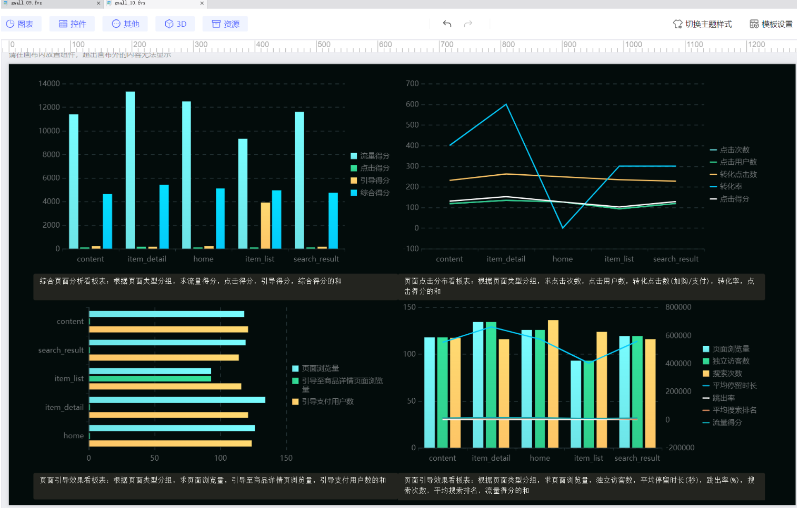

# 项目概述
本项目是一个集 MySQL 模拟数据生成、数据库连接管理、MySQL 到 Hive 表结构与数据同步于一体的工具类项目。主要用于快速生成符合业务规则的 MySQL 测试数据，并同步至 Hive 数据仓库，支持数据仓库开发、测试及数据分析场景。

核心功能包括：
- 基于数据库连接池的 MySQL 连接管理
- 智能生成符合表结构和业务语义的模拟数据
- 自动解析表结构并推断表间关系
- MySQL 与 Hive 数据类型映射及 Hive 外部表 DDL 生成
- 数据仓库各层级（ODS、DWD、DWS、ADS、DIM）的 HDFS 目录管理

# DIM层维度表设计文档

## 1. 商品维度表(dim_product)
### 设计由来
用于存储电商平台商品的标准化维度信息，为后续的商品流量分析、销售分析等提供基础维度数据支持。
### 实现逻辑
1. **数据来源**：直接从ODS层`ods_product_info`表获取原始商品数据
2. **字段处理**：
    - **product_id**：保留原始商品ID，确保唯一标识
    - **product_name**：保留商品名称，用于展示和分析
    - **category_id/category_name**：保留商品类目信息，支持类目维度分析
    - **brand**：保留品牌信息，支持品牌维度分析
    - **price**：保留价格信息，使用DECIMAL(10,2)确保精度
    - **create_time/update_time**：记录商品生命周期时间点
3. **数据质量**：所有字段进行严格类型转换，确保数据一致性
### 设计原因
- **商品分析基础**：为商品流量、转化、销售等分析提供维度支持
- **类目分析**：通过category_id/category_name支持类目维度的聚合分析
- **价格带分析**：精确的price字段支持价格区间分析
- **时间维度**：create_time支持新品分析，update_time支持商品信息变更追踪
## 2. 店铺维度表(dim_store)
### 设计由来
构建店铺的标准维度信息，支持按店铺维度的流量、销售等分析需求。
### 实现逻辑
1. **数据来源**：从用户行为日志`ods_user_behavior_log`中提取店铺相关信息
2. **字段处理**：
    - **store_id**：作为店铺唯一标识
    - **store_name/merchant_id/merchant_name**：目前使用store_id填充，实际业务中应从店铺主表获取
    - **region**：根据store_id前两位生成模拟地区信息
    - **create_time/update_time**：从行为日志中提取店铺首次和最后出现时间
3. **数据生成**：通过用户行为日志中的店铺信息聚合生成
### 设计原因
- **店铺维度分析**：支持按店铺维度的流量、转化等分析
- **地区分析**：通过region字段支持地区维度的分析
- **行为数据补充**：当缺少店铺主数据时，可从用户行为日志中提取基础信息
- **时间维度**：create_time可用于新店分析，update_time用于店铺活跃度分析
## 3. 用户维度表(dim_user)
### 设计由来
构建用户的标准维度信息，支持用户分群、用户行为分析等需求。
### 实现逻辑
1. **数据来源**：从用户行为日志`ods_user_behavior_log`中提取用户相关信息
2. **字段处理**：
    - **user_id**：用户唯一标识
    - **user_name**：当前使用user_id填充，实际应从用户主表获取
    - **user_level**：根据user_id取模生成模拟会员等级
    - **register_time**：取用户最早行为时间作为注册时间
    - **last_login_time**：取用户最近行为时间作为最后登录时间
    - **gender**：根据user_id奇偶生成模拟性别
    - **age_group**：根据user_id取模生成模拟年龄段
3. **数据生成**：通过分析用户行为日志中的时间序列数据生成
### 设计原因
- **用户分群**：通过user_level/gender/age_group支持用户分群分析
- **生命周期分析**：register_time和last_login_time支持用户活跃度分析
- **行为特征补充**：当缺少用户主数据时，可从行为日志中提取基础信息
- **模拟数据**：在没有真实用户属性数据时，提供可分析的维度数据
## 技术实现特点
1. **数据质量保障**：
    - 所有字段进行严格的类型转换
    - 关键字段处理空值情况
    - 写入前清理目标路径，避免数据残留
2. **存储优化**：
    - 采用PARQUET列式存储+Snappy压缩
    - 按dt分区设计，便于按日期管理数据
    - 配置Parquet兼容性参数，确保Hive可读
3. **元数据管理**：
    - 完整的字段注释说明
    - 表属性配置优化查询性能
    - 写入后执行分区修复(MSCK REPAIR)
4. **可观测性**：
    - 关键步骤添加日志输出
    - 写入前后进行数据量统计
    - 最终结果验证确保数据一致性
## 业务价值
1. **统一维度视图**：为不同分析主题提供一致的维度数据
2. **分析灵活性**：支持多维度下钻和上卷分析
3. **数据一致性**：确保不同分析报告中同一维度的解释一致
4. **性能优化**：预计算的维度表减少即席查询的计算压力

# DWD层用户行为明细表设计文档
## 设计由来
构建电商平台用户行为明细数据层，为流量分析、用户行为路径分析、转化漏斗分析等提供原子数据支持。通过对ODS层原始用户行为数据进行清洗、标准化和丰富，形成结构化的明细数据表。
## 实现逻辑
### 数据来源
- 直接从ODS层`ods_user_behavior_log`表获取原始用户行为数据
- 仅过滤指定日期分区（dt='20250808'）的数据
### 核心字段处理方案
1. **基础标识字段**：
    - `user_id`：用户唯一标识，空值处理为"UNKNOWN_USER"
    - `session_id`：会话标识，空值处理为"UNKNOWN_SESSION"
    - `store_id`：店铺标识，空值处理为"UNKNOWN_STORE"
    - `item_id`：商品标识，空值处理为"UNKNOWN_ITEM"
2. **行为类型字段**：
    - `page_type`：将数字编码映射为可读字符串（1→home, 2→item_list等）
    - `event_type`：将数字编码映射为行为类型（1→view, 2→search等）
3. **行为属性字段**：
    - `event_time`：行为时间，空值填充默认时间"1900-01-01 00:00:00"
    - `search_rank`：搜索排名，保留原始值，空值允许为NULL
    - `duration`：停留时长（秒），空值填充0
    - `acquisition_cost`：获客成本，保留2位小数，空值填充0.00
4. **用户属性字段**：
    - `is_new_customer`：新客标识（1/0），空值填充0
    - `repurchase_flag`：复购标识（1/0），空值填充0
    - `rating`：评分（1-5分），空值填充3（中位值）
### 数据质量控制
1. 原始数据分布检查（执行groupBy统计各字段分布）
2. 空值处理策略（根据字段特性采用不同默认值）
3. 类型强制转换（确保字段类型符合目标表定义）
4. 写入后验证（检查记录数、字段分布等）
## 设计原因
### 字段设计考量
1. **完备的行为上下文**：
    - 保留user_id+session_id支持用户粒度和会话粒度分析
    - store_id+item_id支持商品和店铺维度下钻
    - page_type+event_type完整描述行为场景
2. **行为质量指标**：
    - duration支持停留时长分析
    - search_rank支持搜索效果评估
    - acquisition_cost支持ROI分析
3. **用户分层标识**：
    - is_new_customer支持新老客对比分析
    - repurchase_flag支持复购率分析
    - rating支持用户满意度分析

### 技术实现特点
1. **宽松的空值处理**：
    - 关键ID类字段设置未知标识而非丢弃
    - 数值型字段设置业务合理的默认值
    - 允许search_rank为NULL避免信息失真
2. **类型安全转换**：
    - 所有字段显式转换为目标类型
    - 金额字段使用decimal(10,2)保证精度
    - 时间字段统一为字符串格式
3. **可追溯的数据处理**：
    - 保留原始update_time字段
    - 添加dt分区字段支持增量处理
    - 详细的处理日志输出
## 业务应用场景
1. **流量分析**：
    - 通过event_type='view'+page_type分析各页面流量
    - 结合duration计算平均停留时长
    - 通过is_new_customer分析新老客占比
2. **转化漏斗分析**：
    - 追踪view→add_to_cart→payment事件序列
    - 计算各步骤转化率
    - 分析不同page_type的转化差异
3. **搜索效果分析**：
    - 通过event_type='search'记录分析搜索行为
    - 结合search_rank评估搜索结果质量
    - 分析搜索后加购/支付转化
4. **用户分群分析**：
    - 根据is_new_customer/repurchase_flag分群
    - 分析不同分群的行为特征
    - 结合rating识别高价值用户
## 技术实现保障
1. **存储优化**：
    - 采用Parquet列式存储+Snappy压缩
    - 按dt分区设计，便于增量管理
    - 配置TBLPROPERTIES优化查询性能
2. **数据可观测性**：
    - 关键步骤添加数据量统计
    - 字段分布检查确保数据质量
    - 最终验证确保数据一致性
3. **元数据管理**：
    - 完整的字段注释说明
    - 明确的字段类型定义
    - 分区字段设计便于数据管理

# DWS层流量主题聚合表设计文档
## 1. 页面流量分析日汇总表(dws_page_traffic_analysis_d)
### 设计由来
为电商平台提供页面流量质量的核心评估指标，从流量规模、用户质量、搜索行为三个维度评估各店铺页面的流量表现，支撑流量运营决策。
### 实现逻辑
1. **数据来源**：基于DWD层`dwd_user_behavior_log`的view/search事件数据
2. **聚合维度**：按`store_id`+`page_type`双重维度聚合
3. **核心指标计算**：
    - **流量规模指标**：
        - `page_views`：统计view事件数量（反映页面曝光量）
        - `unique_visitors`：统计去重用户数（反映覆盖用户广度）
    - **用户质量指标**：
        - `avg_stay_duration`：计算平均停留秒数（反映内容吸引力）
        - `bounce_rate`：统计停留<10秒的占比（反映内容匹配度）
    - **搜索行为指标**：
        - `search_count`：统计search事件次数（反映搜索功能使用频率）
        - `avg_search_rank`：计算平均搜索排名（反映搜索效果）
### 设计原因
- **双重维度聚合**：支持按店铺和页面类型交叉分析
- **多角度评估**：同时衡量流量数量和质量
- **搜索专项分析**：独立评估搜索相关指标
- **防除零处理**：所有比率计算包含coalesce保护
- **精确小数控制**：时长/比率指标统一保留2位小数
## 2. 页面点击分布日汇总表(dws_page_click_distribution_d)
### 设计由来
分析用户在各页面的点击行为转化路径，评估页面内容对转化行为的引导效果，识别高转化率页面。
### 实现逻辑
1. **数据来源**：基于DWD层`dwd_user_behavior_log`的view/add_to_cart/payment事件
2. **聚合维度**：按`store_id`+`page_type`双重维度聚合
3. **核心指标计算**：
    - **点击基础指标**：
        - `click_count`：统计view事件数（反映页面点击量）
        - `click_users`：统计去重用户数（反映点击用户规模）
    - **转化指标**：
        - `conversion_clicks`：统计加购和支付事件数（反映转化效果）
        - `conversion_rate`：转化点击数/总点击量（反映转化效率）
### 设计原因
- **转化漏斗分析**：清晰追踪从点击到转化的完整路径
- **双重维度下钻**：支持分析不同店铺不同页面的转化特性
- **核心比率指标**：转化率直接反映页面商业价值
- **事件类型合并**：将加购和支付统一视为有效转化
## 3. 页面引导效果日汇总表(dws_page_guidance_effect_d)
### 设计由来
评估页面引导用户深入浏览和完成支付的能力，特别关注从列表页到详情页的关键路径转化效果。
### 实现逻辑
1. **数据来源**：基于DWD层`dwd_user_behavior_log`的view/payment事件
2. **聚合维度**：按`store_id`+`page_type`双重维度聚合
3. **核心指标计算**：
    - **引导过程指标**：
        - `to_item_detail_views`：统计从非详情页跳转到详情页的浏览量
        - `guidance_rate`：引导至详情页的浏览量占比
    - **结果指标**：
        - `payment_users`：统计完成支付的去重用户数
        - `payment_amount`：汇总支付金额（反映最终商业价值）
### 设计原因
- **关键路径优化**：重点监控列表页→详情页的引导效率
- **结果导向设计**：将引导行为与最终支付关联分析
- **金额汇总**：直观衡量页面贡献的商业价值
- **异常值处理**：payment_amount使用decimal(15,2)存储大额数据
## 技术实现特点
1. **数据质量保障**：
    - 所有聚合前过滤NULL值（store_id/page_type）
    - 关键比率计算包含分母为零的保护逻辑
    - 写入前进行数据量验证
2. **存储优化**：
    - 采用ORC列式存储+Snappy压缩
    - 按dt分区设计，便于增量管理
    - 配置TBLPROPERTIES优化查询性能
3. **计算效率**：
    - 使用countDistinct精确计算独立访客数
    - 采用round统一控制小数精度
    - 使用coalesce处理空值情况
4. **可观测性**：
    - 每个步骤输出处理日志
    - 最终验证各表记录数
    - 示例数据展示检查数据合理性
## 业务应用价值
1. **流量运营**：
    - 识别高流量低转化页面进行优化
    - 发现搜索排名与点击量的相关性
    - 监控各页面跳出率变化趋势
2. **页面优化**：
    - 对比不同店铺同类页面的转化差异
    - 分析引导率高的页面设计特征
    - 定位支付转化瓶颈页面
3. **资源分配**：
    - 根据流量得分分配推广资源
    - 识别高商业价值页面重点维护
    - 优化搜索排名提升流量质量
4. **用户体验**：
    - 通过停留时长评估内容质量
    - 分析不同页面的用户行为路径
    - 改进低引导率页面的用户动线设计

# ADS层流量主题分析看板设计文档
## 1. 页面流量分析看板(ads_page_traffic_dashboard)
### 设计由来
整合DWS层流量指标并计算综合评分，为运营团队提供直观的页面流量质量评估工具，支持快速识别高价值和待优化的页面。
### 核心指标设计
1. **基础指标继承**：
    - `page_views`：直接来自DWS层，反映页面曝光量
    - `unique_visitors`：继承DWS层，衡量用户覆盖广度
    - `avg_stay_duration`：保留DWS计算结果，评估内容吸引力
    - `bounce_rate`：沿用DWS跳出率，反映内容匹配度
2. **创新指标**：
    - `traffic_score`：通过加权计算（浏览量30%+访客数30%+停留时长20%+跳出率反向20%）生成0-100分标准化评分
    - **设计特点**：
        - 浏览量/访客数采用动态归一化（/1000和/100）
        - 跳出率取反向值（100-bounce_rate）
        - 使用F.least控制得分不超过100分
        - 空值保护确保计算稳定性
### 业务价值
- **快速诊断**：通过traffic_score一眼识别优质流量页面
- **多维度对比**：支持店铺间、页面类型间的横向比较
- **趋势监控**：分区存储便于分析指标变化趋势
## 2. 页面点击分布看板(ads_page_click_dashboard)
### 设计由来
评估页面点击行为的转化效率，识别高转化率页面模板，优化页面内容布局和商品展示策略。
### 核心指标设计
1. **基础指标继承**：
    - `click_count`：来自DWS层view事件计数
    - `click_users`：继承DWS层去重用户数
    - `conversion_rate`：保持DWS层计算逻辑（转化数/点击量）
2. **创新指标**：
    - `click_score`：综合评估点击规模和质量（点击量40%+点击用户30%+转化数30%）
    - **设计特点**：
        - 不同指标采用差异化归一化（点击量/100，用户数/50）
        - 转化数赋予较高权重（30%）
        - 动态权重分配反映业务优先级
### 业务价值
- **转化漏斗优化**：识别从点击到转化的瓶颈环节
- **页面模板评估**：对比不同页面设计的转化效率
- **资源分配依据**：根据click_score优先优化低分页面
## 3. 页面引导效果看板(ads_page_guidance_dashboard)
### 设计由来
评估页面引导用户完成关键路径的效果，特别关注从浏览到支付的转化效率，优化用户动线设计。
### 核心指标设计
1. **核心指标继承**：
    - `guidance_rate`：保持DWS引导至详情页的比率
    - `payment_amount`：直接汇总DWS层支付金额
2. **创新指标**：
    - `guidance_score`：综合评估引导效果（引导率40%+支付用户30%+支付金额30%）
    - **设计特点**：
        - 支付金额采用/1000归一化处理
        - 引导率直接参与计算（0.4权重）
        - 支付相关指标合计占60%权重
### 业务价值
- **关键路径优化**：重点提升列表页→详情页的引导效率
- **商业价值评估**：通过payment_amount量化页面贡献
- **动线设计验证**：验证页面跳转设计的合理性
## 4. 综合页面分析看板(ads_comprehensive_page_analysis)
### 设计由来
整合三大看板核心指标，提供页面表现的全局视图，建立统一的页面质量评估体系。
### 核心指标设计
1. **指标整合**：
    - `traffic_score`：继承流量看板得分
    - `click_score`：继承点击看板得分
    - `guidance_score`：继承引导看板得分
2. **创新指标**：
    - `overall_score`：加权综合得分（流量40%+点击30%+引导30%）
    - `grade`：基于综合得分的等级划分（A/B/C/D）
    - **设计特点**：
        - 流量得分权重最高（40%）反映基础重要性
        - 等级划分采用行业通用标准
        - 显示各维度得分便于问题诊断
### 业务价值
- **全局视图**：一张表掌握页面整体表现
- **优先级排序**：通过grade快速识别重点优化页面
- **根因分析**：对比三个维度得分定位具体问题
- **绩效评估**：为页面运营团队提供量化考核依据
## 技术实现亮点
1. **数据健壮性**：
    - 全字段coalesce空值处理
    - 所有计算包含防除零保护
    - 得分计算限制0-100范围
2. **存储优化**：
    - 采用Parquet列式存储+Snappy压缩
    - 分区设计（dt）支持增量更新
    - 合理设置Decimal精度平衡存储效率
3. **可观测性**：
    - 关键步骤数据量验证
    - 样本数据展示检查
    - 统计分数分布验证合理性
    - 最终结果记录数核对
4. **业务适应性**：
    - 权重参数可灵活调整
    - 等级标准可配置
    - 支持多维度下钻分析
## 业务应用场景
1. **日常运营监控**：
    - 跟踪各页面score变化趋势
    - 监控grade分布变化
    - 预警得分骤降的页面
2. **专题分析**：
    - 分析高traffic_score但低click_score的原因
    - 研究高guidance_rate但低payment_amount的症结
    - 对比不同店铺同类页面的score差异
3. **资源分配决策**：
    - 优先优化D级页面
    - 复制A级页面的成功要素
    - 根据score调整推广资源分配
4. **效果评估**：
    - 评估页面改版前后的score变化
    - 分析运营活动对页面指标的影响
    - 验证搜索算法优化效果

图一：综合页面分析看板表：根据页面类型分组，求流量得分，点击得分，引导得分，综合得分的和
图二：页面点击分布看板表：根据页面类型分组，求点击次数，点击用户数，转化点击数(加购/支付)，转化率，点击得分的和
图三：页面引导效果看板表：根据页面类型分组，求页面浏览量，引导至商品详情页浏览量，引导支付用户数的和
图四：页面引导效果看板表：根据页面类型分组，求页面浏览量，独立访客数，平均停留时长(秒)，跳出率(%)，搜索次数，平均搜索排名，流量得分的和